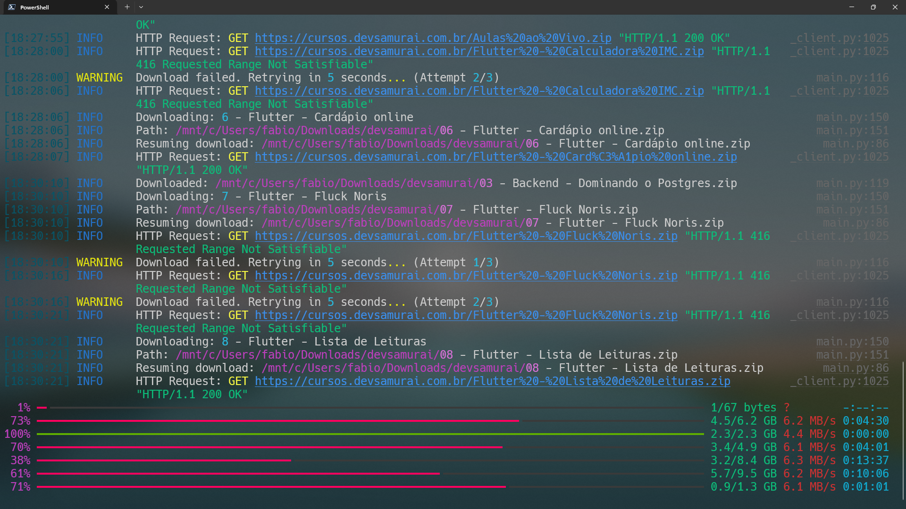

## English Version

# Dev Samurai Course Downloader

This project is a Python script that downloads courses from Dev Samurai's website efficiently using concurrent downloads.

## Installation

### Using venv and pip

1. Clone the repository:
   ```bash
   git clone https://github.com/yourusername/dev-samurai-downloader.git
   cd dev-samurai-downloader
   ```

2. Create and activate a virtual environment:
   ```bash
   python -m venv venv
   source venv/bin/activate  # On Windows, use `venv\Scripts\activate`
   ```

3. Install the required packages:
   ```bash
   pip install -r requirements.txt
   ```

### Using Poetry

1. Clone the repository:
   ```bash
   git clone https://github.com/yourusername/dev-samurai-downloader.git
   cd dev-samurai-downloader
   ```

2. Install dependencies using Poetry:
   ```bash
   poetry install
   ```

## Usage

Run the script with default settings:

```bash
python main.py
```

Or customize the download settings:

```bash
python main.py --download-path courses --threads 10 --timeout 60
```

Use `python main.py --help` for more information on available options.

## Technologies and Techniques Used

- **Concurrent Downloads**: Uses `ThreadPoolExecutor` for parallel downloads.
- **HTTP Requests**: Utilizes `httpx` for efficient HTTP requests.
- **Web Scraping**: Employs `parsel` for HTML parsing.
- **Progress Tracking**: Implements `rich` for beautiful progress bars and logging.
- **Command-line Interface**: Uses `rich_click` for an enhanced CLI experience.
- **Type Hinting**: Incorporates Python type hints for better code readability.
- **Dataclasses**: Utilizes Python's dataclasses for clean data structures.
- **Resume Downloads**: Implements download resumption using the `Range` header.

## TODO

- [x] Implement basic course fetching
- [x] Add concurrent downloads
- [x] Implement progress tracking
- [x] Add CLI with customizable options
- [x] Implement download resumption
- [ ] Add unit tests
- [ ] Implement error handling for network issues
- [ ] Add support for authentication
- [ ] Optimize memory usage for large downloads
- [ ] Implement a GUI version

## Example

Here's an example of the script in action:


