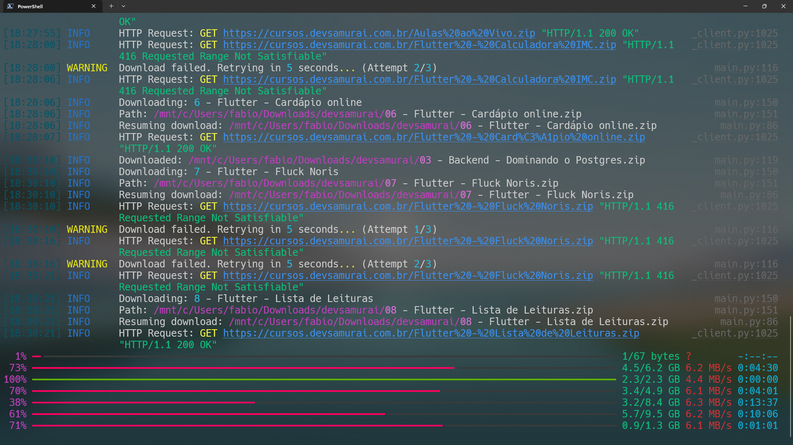

# Baixador de Cursos Dev Samurai

Este projeto é um script Python que baixa cursos do site Dev Samurai de forma eficiente usando downloads concorrentes.

## Instalação

### Usando venv e pip

1. Clone o repositório:
   ```bash
   git clone https://github.com/seuusuario/dev-samurai-downloader.git
   cd dev-samurai-downloader
   ```

2. Crie e ative um ambiente virtual:
   ```bash
   python -m venv venv
   source venv/bin/activate  # No Windows, use `venv\Scripts\activate`
   ```

3. Instale os pacotes necessários:
   ```bash
   pip install -r requirements.txt
   ```

### Usando Poetry

1. Clone o repositório:
   ```bash
   git clone https://github.com/seuusuario/dev-samurai-downloader.git
   cd dev-samurai-downloader
   ```

2. Instale as dependências usando Poetry:
   ```bash
   poetry install
   ```

## Uso

Execute o script com as configurações padrão:

```bash
python main.py
```

Ou personalize as configurações de download:

```bash
python main.py --download-path cursos --threads 10 --timeout 60
```

Use `python main.py --help` para mais informações sobre as opções disponíveis.

## Tecnologias e Técnicas Utilizadas

- **Downloads Concorrentes**: Usa `ThreadPoolExecutor` para downloads paralelos.
- **Requisições HTTP**: Utiliza `httpx` para requisições HTTP eficientes.
- **Web Scraping**: Emprega `parsel` para análise de HTML.
- **Acompanhamento de Progresso**: Implementa `rich` para belas barras de progresso e logging.
- **Interface de Linha de Comando**: Usa `rich_click` para uma experiência CLI aprimorada.
- **Type Hinting**: Incorpora type hints do Python para melhor legibilidade do código.
- **Dataclasses**: Utiliza dataclasses do Python para estruturas de dados limpas.
- **Retomada de Downloads**: Implementa retomada de download usando o cabeçalho `Range`.

## TODO

- [x] Implementar busca básica de cursos
- [x] Adicionar downloads concorrentes
- [x] Implementar acompanhamento de progresso
- [x] Adicionar CLI com opções personalizáveis
- [x] Implementar retomada de download
- [ ] Adicionar testes unitários
- [ ] Implementar tratamento de erros para problemas de rede
- [ ] Adicionar suporte para autenticação
- [ ] Otimizar o uso de memória para downloads grandes
- [ ] Implementar uma versão com interface gráfica

## Exemplo

Aqui está um exemplo do script em ação:

